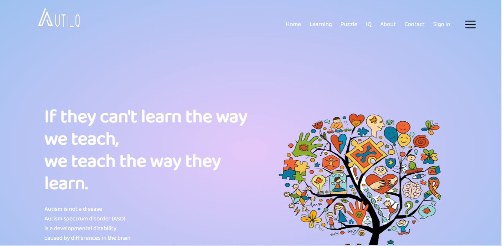

<h2>Auti_Q Project</h2>

The goal of our project is to increase the IQ level and to determine the fields of their interest. Tech - JAVA, Spring boot, Spring security, JPA, MySQL, JSP

<h2> play the video </h2>

Video Link: https://www.youtube.com/watch?v=xrMonjL2BCE&t=3s
     

<h2>To run the Project</h2>
1. Find The DB folder and inside that autiq.sql  file import that into MySQL Database  
2. then setup => java and gradle build tool on your machine   
3. run the Projct => spring boot 